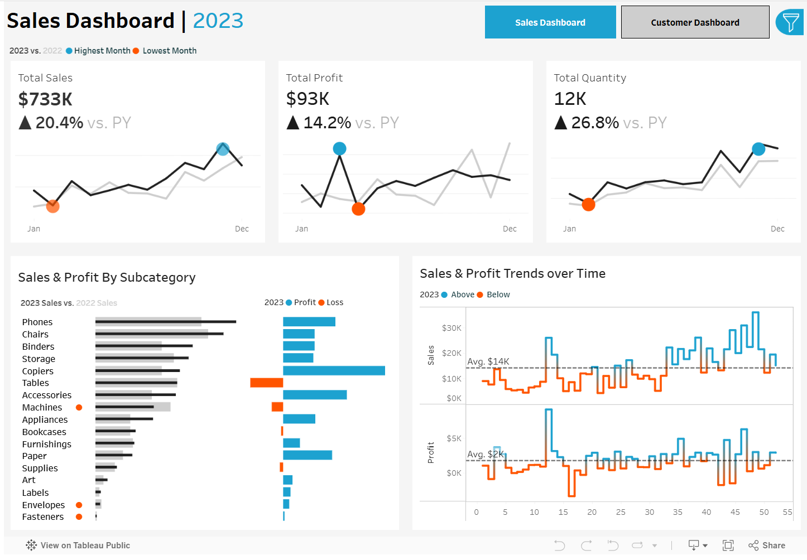
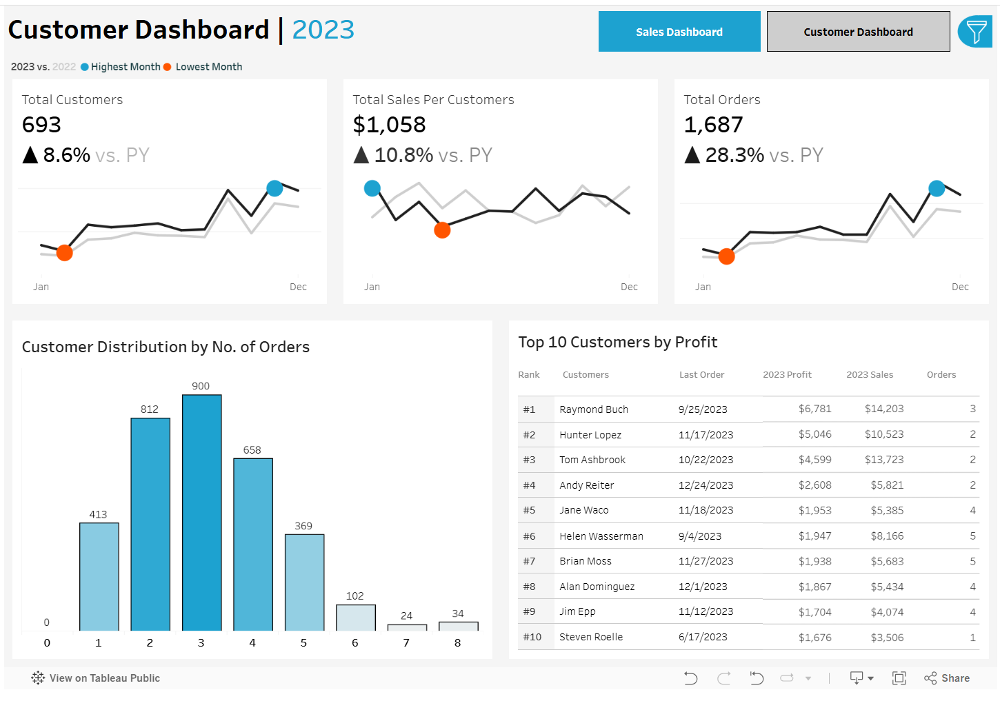

# Sales & Customer Analytics Dashboard

Interactive Tableau dashboards for analyzing sales performance and customer behavior to support data-driven business decisions.

## Overview

Two comprehensive dashboards providing insights into sales metrics, customer trends, and business performance with year-over-year comparisons.

## Dashboards

### Sales Dashboard

**Key Features:**
- KPI overview (Total Sales, Profit, Quantity)
- Monthly sales trends with highest/lowest month indicators
- Product subcategory performance comparison
- Weekly sales and profit trends with average benchmarks

### Customer Dashboard

**Key Features:**
- Customer KPIs (Total Customers, Sales per Customer, Orders)
- Monthly customer trends analysis
- Customer distribution by order frequency
- Top 10 customers by profit with detailed metrics

## Live Dashboard

View the interactive dashboard on Tableau Public:
[Sales & Customer Analytics Dashboard](https://public.tableau.com/app/profile/your-profile/viz/sales-customer-analytics)

## Getting Started

1. Download Tableau Desktop or Tableau Public
2. Open `S&C Dashboard.twb`
3. Connect to your data source
4. Use year selector and filters to explore the data

## Key Features

**Interactivity:**
- Dynamic year selection for historical analysis
- Cross-dashboard navigation
- Interactive filtering by product and location
- Click any chart to filter related data

**Filters Available:**
- Product: Category, Subcategory
- Location: Region, State, City
- Time Period: Year selection

## Usage

- Select year from dropdown to analyze different periods
- Switch between dashboards using navigation buttons
- Apply filters using the filter panel
- Click on charts for cross-filtering
- Hover over data points for detailed information

## Metrics Definitions

**Sales Dashboard:**
- Total Sales, Profit, Quantity with YoY comparison
- Monthly and weekly performance trends
- Subcategory sales and profit analysis

**Customer Dashboard:**
- Total Customers, Sales per Customer, Total Orders
- Customer segmentation by order count
- Top customers with profit, sales, and order details
